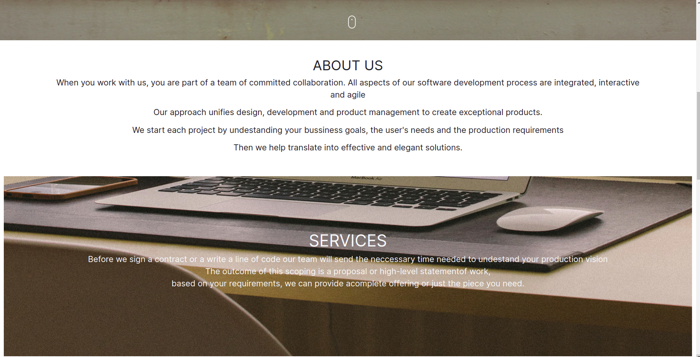
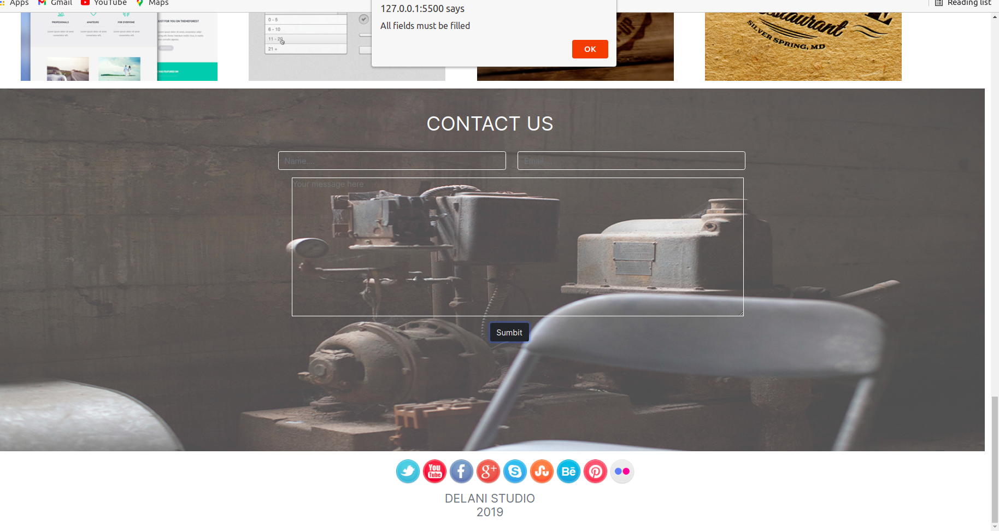
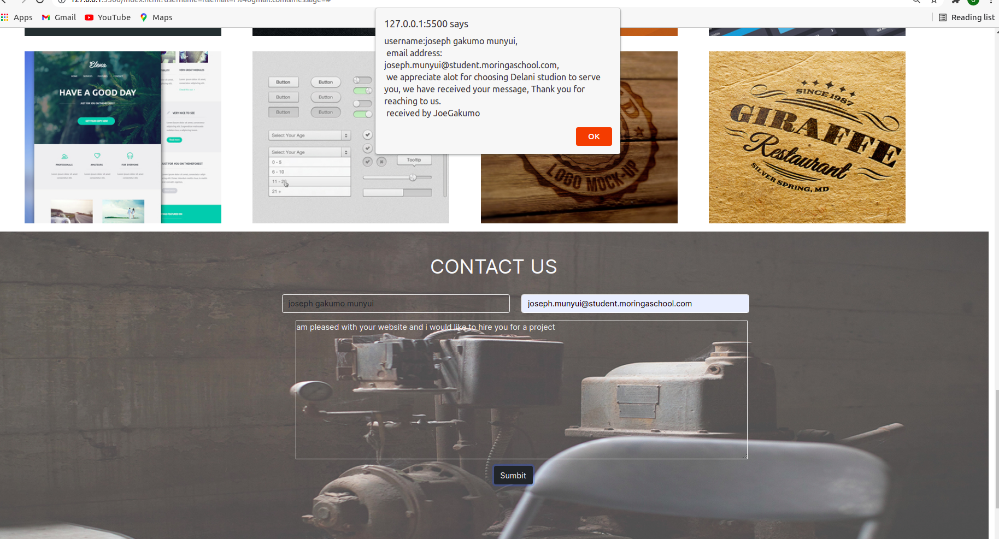

# Delani Studio Website
###  Delani studio website is a studio company that shows the user a brief and clear portlay of what they offer, some projects they have worked on before one can hire them.
This project was created on 24th July 2021
 By <a href="#"> Joseph Gakumo Munyui</a>
 # setup/installation Requirements
 * Visual studio code  or Atom editor
 * A browser preferablely Chrome
  ### How to access it locally to your machine
   * ensure you have new folder where you intend to set it up.
   * run this comand in your terminal git clone https://github.com/JoeGakumo21/Delani-Studio-IP

# Known Bugs
 -  sor far the website has no bugs
 # Technologies used
- HTML
* CSS
* BOOTSTAP
* JAVASCRIPT
* JQUERY
# live link
<a href="https://joegakumo21.github.io/Delani-Studio-IP/">Delani Studio Website</a>

# Contact Me
 Incase of any issue or more details feel free to contact me via:

      phone: +254791279635
      email:joegakumo1@gmail.com
      facebook:JoeKumo

## Website Screenshots

{find the attached licence document }
<a href="https://choosealicense.com/licenses/mit/#">MIT LICENCE</a>
&copy; 2021